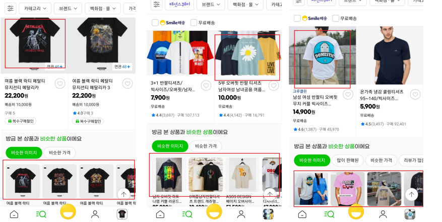

(<a href="https://github.com/Zolboo21/image-classification-website/blob/main/README.md">Go to English version</a>)

<!-- INTRO -->

  
<h3 align="center">유사 패션 이미지 추천</h2>

  

    <a href="http://210.115.229.250:3000/#">웹사이트</a>
    ·
    <a href="https://github.com/Zolboo21/image-classification-website/issues">버그 신고</a>
    ·
    <a href="https://github.com/Zolboo21/image-classification-website/blob/main/teamkr.md">팀 구성원</a>
  

<!-- ############################################################# TABLE OF CONTENTS ################################################################## -->

  
목차

  <ol>
    <li>
      <a href="#project-overview">프로젝트 개요</a>
    </li>
    <li>
      <a href="#project-architecture">프로젝트 아키텍처</a>
    </li>
    <li>
      <a href="#technology-stack">기술 스택</a>
    </li>
    <li>
      <a href="#implemented-features">구현된 기능</a>
    </li>
  </ol>

## 프로젝트 개요

  

  <strong>시각적으로 유사한 패션 이미지를 활용하여 제품 검색 기능 향상</strong>

시각적으로 유사한 패션 이미지를 활용하여 제품 검색 기능을 향상시키는 '유사 패션 이미지 추천' 프로젝트는 CNN 알고리즘을 포함한 고급 딥러닝 기법을 사용하여 기존의 이미지 분류 방법의 한계를 극복합니다. 웹 기반 시스템을 통해 사용자에게 시각적으로 유사한 패션 이미지를 제공하여 제품 검색 방식을 혁신합니다.

G마켓의 유사 이미지 추천 기능을 참고하여 본 프로젝트는 실행 시간, 비용 및 디스크 저장 요구 사항의 개선에 초점을 맞추고 있습니다. 벡터 데이터베이스를 사용하여 이미지 특징을 효율적으로 저장하고 검색합니다. Docker 컨테이너화를 통해 확장성과 플랫폼 간 쉬운 배포를 보장합니다.

백엔드는 유연하고 견고한 API 구현을 위해 Python Flask를 사용하여 구축되었습니다. 프론트엔드는 React를 사용하여 상호작용적이고 반응형 사용자 인터페이스를 제공합니다. 디자인 협업을 위해 Figma를 사용하여 시각적으로 매력적이고 사용자 친화적인 경험을 제공합니다.

저희 시스템은 딥러닝을 위한 강력한 라이브러리인 TensorFlow를 활용합니다. CNN 모델을 개발하고 세밀하게 조정하여 이미지 분류의 높은 정확도를 달성합니다. 우리의 솔루션을 통해 사용자는 시각적으로 유사한 패션 이미지를 쉽게 탐색할 수 있으며 쇼핑 경험을 향상시킬 수 있습니다.

### 유사 이미지 추천이란?

G마켓 앱은 2022년 5월에 유사 이미지 추천 기능을 도입했습니다. 이 기능은 동일한 제품 이미지가 아닌 시각적으로 유사한 이미지를 표시하여 사용자가 제품을 더 쉽게 발견할 수 있도록 돕습니다.

저희는 비공개 유사 이미지 사이트를 생성하여 사용자가 시각적으로 유사한 패션 이미지에 빠르고 쉽게 액세스할 수 있도록 실험을 진행할 예정입니다.

## 프로젝트 아키텍처

  

## 기술 스택

- 프론트엔드: [React](https://reactjs.org/) 
  - 웹 페이지 UI
  - 인터페이스 구현

- 프론트엔드: [Figma](https://www.figma.com/) 
  - 웹 페이지 UI 디자인 프로토타이핑

- 백엔드: [Flask](https://flask.palletsprojects.com/) 
  - 서버와의 API 통신

- 백엔드: [Weaviate](https://www.semi.technology/developers/weaviate/current/) 
  - Docker를 사용하여 벡터 공간에 이미지 데이터셋 저장

- 백엔드: [TensorFlow](https://www.tensorflow.org/) 
  - TensorFlow CNN 모델을 사용하여 이미지 데이터셋 학습

- Docker 
  - 효율적인 배포를 위한 컨테이너화

## 구현된 기능

### I. 프론트엔드

#### 1. 버전 1 - 부트스트랩 기반의 메뉴 바 및 메인 창 UI

#### 2. 버전 2 - 결과 이미지 표시 및 모달 창이 포함된 개선된 사용자 인터페이스

### II. 백엔드 및 API 통신

#### 1. 요청 함수

    fetch('http://{HOST_IP_ADDRESS}:5000/process_image', {
      method: 'POST',
      body: data,
    })
      .then(response => response.json())
      .then(data => {
          setDivContent('');
          setProcessedData(data);
          setHideList(false);
      })
      .catch(error => {
        console.log('Error sending image: ', error);
      });
  
#### 2. 응답 함수
- 요청의 본문에서 데이터를 읽어와 이미지 데이터를 CNN 모델에 전달하여 레이블 예측 수행.

      @app.route("/process_image", method=["POST"])
        def process_image():
        uploaded_file = Image.open(request.files['filepath'].stream)   # request 이미지 파일
        setting = json.loads(request.form['setting'])                  # request 요청 값
        output_limit = setting['output_limit']                         # 최대 출력 갯수

        buffer = BytesIO()
        uploaded_file.save(buffer, format="JPEG")
        img_str = base64.b64encoded(buffer.getvalue()).decode()

        # TODO: cnn model to predict the breed of the closet image
        model_dir = "{HOST_ABSOLUTE_PATH}"
        model_filename = "{MODEL_FILE_NAME}.h5"
        model_path = os.path.join(model_dir, model_filename)

        model = tf.keras.models.load_model(os.path.abspath(model_path))    

        img = tf.keras.preprocessing.image.img_to_array(uploaded_file)
        img = tf.keras.applications.xception.preprocess_input(img)
        img = np.expand_dims(img, axis=0)
        preds = model.predict(img)                      # 모델 예측
        preds2 = np.squeeze(preds)
        predicted_class_index = np.argmax(preds2)
          ...
          ...
        weaviate_results = weaviate_img_search(img_str, label, label2, output_limit)

        results=[]
        for result in weaviate_results:
            results.append({
               "path": result["filepath"],
               "class": result["class"]   
         })

        return results               
      
#### 3. 벡터 데이터베이스
- 입력 쿼리 이미지 및 레이블을 기반으로 유사한 이미지 결과를 Weaviate의 벡터 데이터베이스에서 검색.

      def weaviate_img_search(img_str, label, label2, output_limit=12):
          sourceImage = {"image": img_str}

          try:
              weaviate_results = client.query.get(
                  label, ["filepath", "class"]
              ).with_near_image(
                  sourceImage, encode=False
              ).with_limit(output_cnt).do()

              retyrb weaviate_results["data"]["Get"][label2]
          except KeyError:
              return []

#### 4. 서버 설정
- 다음 단계를 따라 서버 시작:
  
  - Weaviate를 실행하기 위해 Docker를 실행.

        docker conpose up
    
  - 이미지 정보에 대한 스키마 정의.

        python create-schema.py
    
  - 모든 이미지를 base64 형식으로 변환하여 Weaviate에 import.

        python images-to-base64.py

  - 인코딩된 이미지들을 weaviate에 업로드.

        python upload-data-objects.py
    
  - 서버 실행.
    
        python flask-app/application.py 

- Docker Desktop에서 실행 중인 Weaviate.

- 이미지가 base64 버전으로 저장된 디렉토리 경로.

- 모든 이미지를 Weaviate에 import. (6개의 이미지 카테고리마다 개별적으로 수행)

- 서버 실행. (python flask-app/application.py)

---

